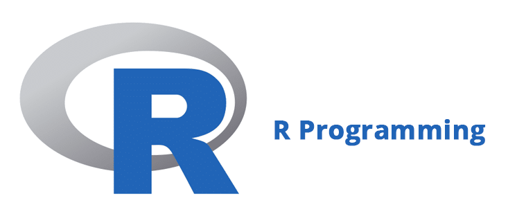

# Data Science (CS301) Lab 3 Assignment

Writing R Code

**Assigned** : Wednesday, 18 September 2024

**Due** : Wednesday, 2 October 2024



## Objectives

The main goals of this work include the following.

- To gain experience using R programming to complete basic statistical tasks
- To work with general syntax of R programming
- To determine whether the R code is correctly addressing the challenge.

## Overview

In this lab, you are to complete the programming challenge questions which are found in the File `src/questions.md`. Once you have completed these challenge questions, please be sure that your code works after you have cleared away the variable memory, removed plots and removed the console output. The code to provide your R-Studio code with a "clean-slate" is the following and is to be run before all other code.

``` {R}
rm(list = ls()) # clear out the variables from memory to make a clean execution of the code.

# If you want to remove all previous plots and clear the console, run the following two lines.
graphics.off() # clear out all plots from previous work.

cat("\014") # clear the console
```

After you have completed the programming challenges, please address the reflection questions in the File `writing/reflection.md`.

### Required Deliverables

- Edit and complete the File `src/questions.md` where you add all relevant code to address the challenges.

- Edit and complete the File `writing/reflection.md` where you add all relevant code to address the challenges.

### Checks for GatorGrader

For immediate feedback on submissions, we will be using Gator Grade to inform the of missing components in the submission. As you submit, you will notice that there is a thick red X that will change to a green check mark when all components have been included in the submission. You are encouraged to click on the red X to find a listing of the components to address.

## Project Assessment

The grade that a student receives on this assignment will have the following components.

- **GitHub Actions CI Build Status [up to 10%]:**: For the lab01 repository associated with this assignment students will receive a checkmark grade if their last before-the-deadline build passes. This is only checking some baseline writing and commit requirements as well as correct running of the program. An additional reduction will given if the commit log shows a cluster of commits at the end clearly used just to pass this requirement. An addition reduction will also be given if there is no commit during lab work times. All other requirements are evaluated manually.

- **Mastery of Technical Writing [up to 40%]:**: Students will also receive a checkmark grade when the responses to the writing questions presented in the `reflection.md` reveal a proficiency of both writing skills and technical knowledge. To receive a checkmark grade, the submitted writing should have correct spelling, grammar, and punctuation in addition to following the rules of Markdown and providing conceptually and technically accurate answers.

- **Mastery of Technical Knowledge and Skills [up to 50%]:** Students will receive a portion of their assignment grade when their program implementation reveals that they have mastered all of the technical knowledge and skills developed during the completion of this assignment. As a part of this grade, the instructor will assess aspects of the programming including, but not limited to, the completeness and the correctness of the program and the use of effective source code comments.

## GatorGrade

You can check the baseline writing and commit requirements for this lab assignment by running department's assignment checking `gatorgrade` tool. To use `gatorgrade`, you first need to make sure you have Python3 installed (type `python --version` to check). If you do not have Python installed, please see:

- [Setting Up Python on Windows](https://realpython.com/lessons/python-windows-setup/)
- [Python 3 Installation and Setup Guide](https://realpython.com/installing-python/)
- [How to Install Python 3 and Set Up a Local Programming Environment on Windows 10](https://www.digitalocean.com/community/tutorials/how-to-install-python-3-and-set-up-a-local-programming-environment-on-windows-10)

Then, if you have not done so already, you need to install `gatorgrade`:

- First, [install `pipx`](https://pypa.github.io/pipx/installation/)
- Then, install `gatorgrade` with `pipx install gatorgrade`

Finally, you can run `gatorgrade`:

`gatorgrade --config config/gatorgrade.yml`

## Submitting Your Work

Use GitHub to submit your work. The commands are the following.

``` {bash}
git add -A
git commit -m "add meaningful commit message"
git push
```

## Seeking Assistance

- Extra resources for using markdown include;
  - [Markdown Tidbits](https://www.youtube.com/watch?v=cdJEUAy5IyA)
  - [Markdown Cheatsheet](https://github.com/adam-p/markdown-here/wiki/Markdown-Cheatsheet)
- Do not forget to use the above git commands to push your work to the cloud for the instructor to grade your assignment. You can go to your GitHub repository using your browser to verify that your files have been submitted. Please see the TL’s or the instructor if you have any questions about assignment submission.

Students who have questions about this project outside of the lab time are invited to ask them in the course's Discord channel, or during instructor's or TL's office hours.
